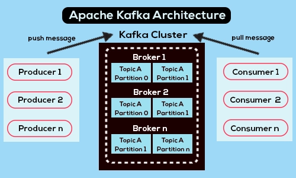

## Một số khái niệm cơ bản:

- **Producer**: Producer là những ứng dụng tạo hoặc thu thập dữ liệu và gửi dữ liệu tới Kafka Server. Dữ liệu này sẽ là những message có định dạng, được gửi dưới dạng mảng byte tới Kafka server.
- **Consumer**: Kafka sử dụng consumer để theo dõi (subscribe) vào topic, các consumer được định danh bằng các group name. Nhiều consumer có thể cùng đọc một topic. Sau khi nhận được data, Consumer có thể thêm code để xử lý data theo nhu cầu của mình.
- **Cluster**: Kafka cluster là một tập các server, mỗi server này được gọi là 1 broker.
- **Broker**: Broker là Kafka server, là cầu nối giữa Message Publisher và Message Consumer, giúp chúng có thể trao đổi message với nhau.
- **Topic**: Dữ liệu truyền trong Kafka theo topic, khi cần truyền dữ liệu cho các ứng dụng khác nhau thì sẽ tạo ra các topic khác nhau.
- **Partitions**: Kafka là một hệ thống phân tán và chúng ta có thể cài đặt Kafka server theo cluster. Trong trường hợp một topic nhận quá nhiều message tại cùng một thời điểm, chúng ta có thể chia topic này thành những partitions được share giữa các Kafka server với nhau trong một cluster. Mỗi một partition sẽ khá nhỏ và độc lập với các partitions khác. Số lượng partition cho mỗi topic thì tuỳ theo nhu cầu của ứng dụng mà chúng ta có thể quyết định.
- **Consumer Group**: Là một nhóm các Consumer từ Kafka server. Các Consumer trong một Consumer Group sẽ chia sẻ việc xử lý các message.
- **ZOOKEEPER**: Được dùng để quản lý và bố trí các broker.

