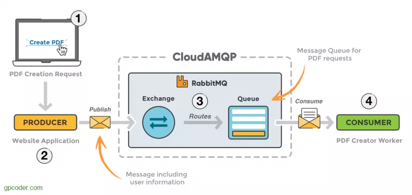

**RabbitMQ** là một message broker (MOM - Message-Oriented Middleware), sử dụng giao thức AMQP (Advanced Message Queue Protocol). RabbitMQ là một phần mềm trung gian được sử dụng như là phương tiện liên lạc giữa các ứng dụng, dịch vụ với nhau.
Đây là kiến trúc cơ bản của một message queue:


- **Producer** : là ứng dụng client, tạo message và publish tới broker.
- **Consumer** : là ứng dụng client khác, kết nối đến queue, subscribe (đăng ký) và xử lý (consume) message.
- **Broker (RabbitMQ)** : nhận message từ Producer, lưu trữ chúng an toàn trước khi được lấy từ Consumer.

Minh họa cách thức hoạt động của **RabbitMQ** như sau:



- **Producer**: Phía bên đảm nhận việc gửi message. Bạn có thể xem đây là người cần gửi thư cho một ai đó.
- **Consumer**: Phía bên đảm nhận việc nhận message. Bạn có thể xem đây là người nhận được thư mà ai đó gửi tới.
- **Message**: Thông tin dữ liệu truyền từ Producer đến Consumer. Đây chính là thư được gửi đi chứa nội dung gửi, nó có thể là thư tay, hàng hóa, bưu phẩm…
- **Queue**: Nơi lưu trữ messages. Bạn có thể xem đây là một hòm lưu trữ thư với cơ chế, ai gửi trước thì được chuyển phát trước (First in first out)
- **Connection**: Kết nối giữa ứng dụng và RabbitMQ broker. Đây có thể coi là các bưu điện đặt tại các tỉnh thành, khi bạn gửi thư thì bạn sẽ phải ra bưu điện đúng không nào
- **Exchange**: Là nơi nhận message được publish từ Producer và đẩy chúng vào queue dựa vào quy tắc của từng loại Exchange. Để nhận được message, queue phải được nằm (binding) trong ít nhất 1 Exchange.. Có thể hiểu đây là một khu vực kho tổng hợp tất cả các thư mà mọi người gửi thư tới được tổng hợp, phân loại khu vực, gửi hàng loạt hay không…
- **Binding**: Đảm nhận nhiệm vụ liên kết giữa Exchange và Queue. Có thể xem đây là quá trình chuyển thừ hòm lưu trữ thư vào kho phân loại.
- **Routing** key: Một key mà Exchange dựa vào đó để quyết định cách để định tuyến message đến queue. Khi kiểm tra địa chỉ trên mỗi bức thư thì Routing key chính là địa chỉ người nhận, khi này việc phân loại thư trong kho sẽ phân loại dựa theo địa chỉ này để đưa tới từng khu vực bưu điện đích.
- **AMQP (Advance Message Queuing Protocol)**: là giao thức truyền message được sử dụng trong RabbitMQ.
- **User**: Gồm username và password giúp truy cập vào RabbitMQ dashboard hoặc tạo connection. Có thể xem đây là những nhân viên bưu điện, họ có thể theo dõi, phân loại, can thiệp, hỗ trợ trong quá trình gửi bưu phẩm.
- **Virtual host/Vhost**: Cung cấp những cách riêng biệt để các ứng dụng dùng chung một RabbitMQ instance. Hãy xem đây là những bưu cục chi nhánh rải trên khắp đất nước để thuận tiện cho người gửi cũng như người nhận.

### DOCKER: docker run -d --hostname rabbit --name rabbitmq -p 5672:5672 -p 15672:15672 rabbitmq:3-management


### ADVANCED CASE:

1. High Availability and Failover
   - Why It Matters: RabbitMQ nodes can crash or go offline. Ensuring your system works seamlessly during such failures is critical.
   - Key Techniques:
     - Set up RabbitMQ clusters with mirrored queues.
     - Enable a high-availability policy (ha-mode: all).
     - Use a failover library for your Node.js client (e.g., retries with exponential backoff).
2. Rate Limiting and Throttling
      - Why It Matters: To avoid overwhelming downstream systems or APIs.
      - Implementation:
        - Use the basic.qos setting to limit unacknowledged messages:
            ```javascript
          channel.prefetch(10); // Process up to 10 messages concurrently
           ```
      - Use rate-limiting libraries (like bottleneck) in combination with consumer callbacks.
3. Dynamic Queue Binding
   - Why It Matters: Applications might need to dynamically bind or unbind queues from exchanges based on runtime conditions.
   - Implementation:
     - Consumers can dynamically declare their own exclusive queues and bind them
     ```javascript
     const queue = await channel.assertQueue('', { exclusive: true });
     await channel.bindQueue(queue.queue, 'exchangeName', 'routingKey');
4. Connection Recovery and Backpressure
   - Why It Matters: To handle transient network failures gracefully.
   - Implementation:
     - Enable automatic recovery in the RabbitMQ client
     ```javascript
     const connection = await amqp.connect('amqp://localhost', { recover: true });

5. Advanced Dead Letter Handling
   - Why It Matters: To avoid losing tasks indefinitely in dead-letter queues.
   - Implementation:
     - Automatically retry messages in dead-letter queues using a retry mechanism.
     - Define policies for different TTL (time-to-live) durations.
6. Sharding or Segmentation
   - Why It Matters: To scale beyond RabbitMQ's single-node performance limits for queues with high traffic.
   - Implementation:
     - Split queues based on business criteria (e.g., shard by user region or priority).
     - Use exchange logic to route specific segments to different queues.
7. Message Acknowledgment Strategies
   - Scenarios:
     - At-Least-Once Delivery: Default behavior where messages are re-delivered until ack is received.
     - At-Most-Once Delivery: Acknowledge messages immediately after receipt (risks data loss).
     - Exactly-Once Delivery (requires deduplication logic):
       - Attach unique message identifiers.
       - Track processed messages in a Redis or database store.
8. Audit and Monitoring
   - Why It Matters: For troubleshooting and ensuring message integrity.
   - Tools:
     - RabbitMQ Management Plugin: Offers a dashboard for queue monitoring.
     - Prometheus Metrics: Integration for analytics.
     - Event Exchange: Log queue and connection events for advanced auditing.
9. Event-Driven Architectures
   - Scenarios:
     - Broadcast Messaging: Use fanout exchanges to notify all subscribers about an event.
     - Delayed Messaging:
       - Install the delayed message exchange plugin.
       - Schedule message processing with
       ```javascript
       channel.publish('exchangeName', 'routingKey', Buffer.from('Task'), { headers: { 'x-delay': 5000 }, // Delays message by 5 seconds });
10. Security Best Practices
    - Scenarios:
      - Per-User Authorization: Use the topic exchange type and bind to specific routing keys.
      - TLS Encryption: Secure connections with TLS.       

